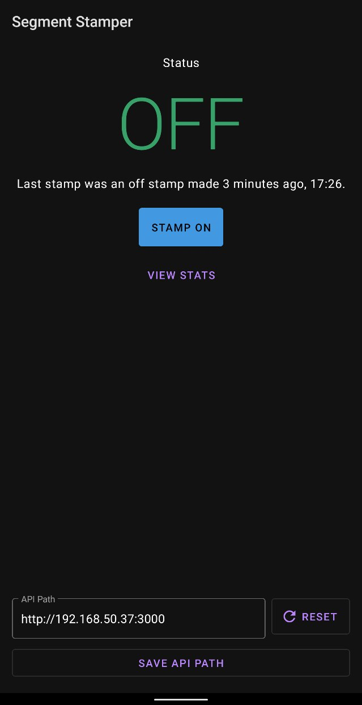
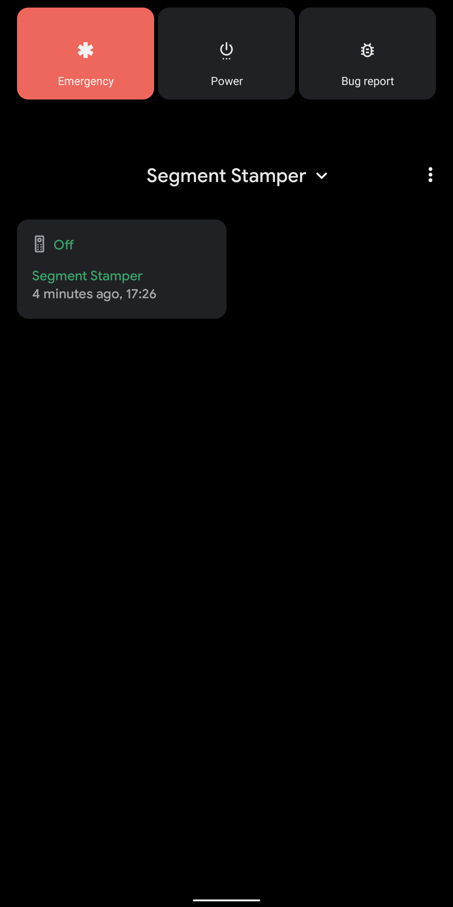
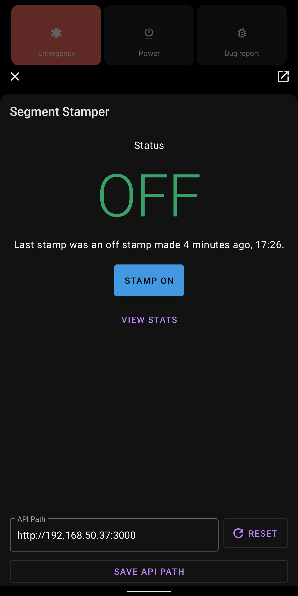

# Segment Stamper (Android)
An Android app served as a companion to [Segment Stamper](https://github.com/blueset/segment-stamper-web).

Segment Stamper is a web app to record timestamps as on and off segments.

| App | Device Control | Device Control Shade |
| - | - | - |
|  |  | 

## Features
* Native stamping interface
* Stamp toggle as a smart home device control for Android 11.

## Prerequisites
* [Segment Stamper Web App](https://github.com/blueset/segment-stamper-web)

## Build and install
* Open project with Android Studio
* Sync Gradle
* Build and install

## Before Use
Set the base API path either in `app/config.properties` or at the bottom of the app screen.

The path should be WITHOUT trailing slash, e.g. `https://stamper.example.com`.

### Example of `app/config.properties`

```bash
BASE_API_PATH=https://stamper.example.com
```
 